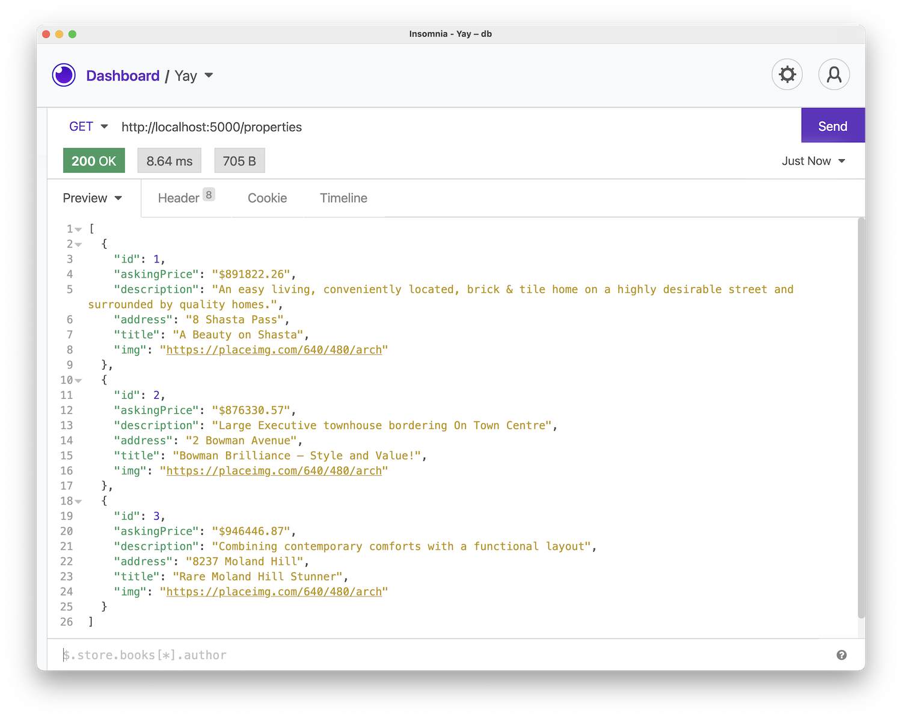

# 02 Exercise - My first API endpoint in Express 

## Brief

You will build your first endpoint for the House Tricks API to retrieve all the property listings. Your Tech Lead has provided you with a starting point, so you can get right into learning how to create a single endpoint.

The endpoint you build will meet the following specifications:

### Request

- Endpoint: `/properties`
- Method: `GET`

### Response 

- Status code: `200`
- JSON body: See screenshot below

## Getting Started

Watch the [Getting started video](https://www.loom.com/share/637407b2ab9a44b9aadc556c10255698) that demonstrates the below steps.

1. Open your Terminal in VS Code, and install the required dependencies: `npm install`
2. Start the API server: `npm start`
3. Open Insomnia, and test the server is working by making a `GET` request to the following URL: `http://localhost:5001/properties/1`. You should get a response for a single property. Seeing a status code of `200` and a JSON object in the response body means your API server is working as expected.
4. Open `src/app.js` in VS Code, and find the code comment that starts with `// FIXME`. This is where you will be writing your code.

## Instructions

- In `app.js`, create a new `GET` endpoint that returns all properties. Name the endpoint `/properties`.
- Use the existing endpoint as a reference. However, be aware your endpoint will be much simpler, as you will return all properties and not have to find one property.
- The `properties` variable is configured for you. You can return this variable in your endpoint.
- Use Insomnia to test your API endpoint. When complete, you should be able to make a `GET` request to `http://localhost:5001/properties` and see the properties in the response.
- Once complete, you can check your code is correct by running automated tests. In your Terminal, stop your API server by typing `control-c`. Then type: `npm test`, and check the tests pass. These are the same tests that run in GitHub

--- 

# Submit your Exercise

- [ ] Automated tests pass in GitHub
- [ ] Turned in exercise in Google Classroom

